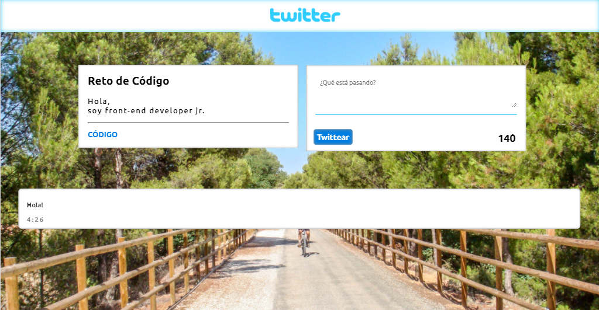

# Twitter

***
## Se utilizó

`HTML`   `CSS`   `JS`

## Descripción

Se trata de imitar la dinámica de la verdadera página de Twitter, se puede agregar una tweet 
uno debajo imprimiendo en el mismo la hora exacta en que se realizó.
En este trabajo se ha aplicado todo lo parendido hasta ahora en **js**, **css** y **html**.

-El trabajo lo dividí en 3 secciones:
*Header
*Section (2 divs dentro)

##Trabajo terminado

## Especificaciones

* Esta web utilizó la tipografía: `Ubuntu`.
* Los íconos de redes sociales puedes obtenerlos de [Font Awesome](http://fontawesome.io/).como el logo fueron descargados de la web.
* Para el formulario se utilizó las etiquetas como `form`, `button` `textarea`.

`Nota:`

*Este trabajo se ha subido a gh-pages [aquí](https://yaniraab.github.io/twitter/).

